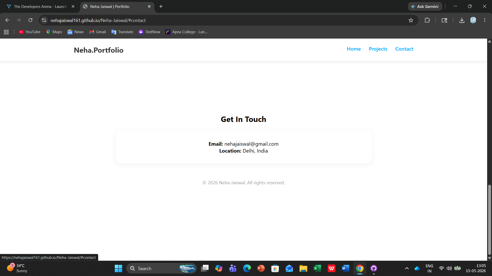

# Week 1 Project: Responsive Personal Portfolio Website

A professional and high-performance portfolio developed as part of the internship curriculum. This project serves as a comprehensive digital showcase of technical projects, skills, and academic achievements, built with a focus on modern web standards and responsive design.

---

## 1. Project Overview
The objective of this project was to develop a seamless, end-to-end user experience that highlights my expertise in **Machine Learning** and **Web Development**. The site is optimized for performance and accessibility, ensuring a consistent look and feel across all device architectures.

## 2. Setup Instructions
To run this project locally on your machine, follow these steps:
1. **Clone/Download**: Download the repository as a ZIP file and extract the contents.
2. **Directory Structure**: Ensure your folder hierarchy matches: `index.html` at the root, with `/css`, `/js`, and `/images` as subfolders.
3. **Execution**: Right-click `index.html` and select **"Open with Live Server"** in VS Code, or double-click the file to launch it in any modern browser like Chrome or Edge.

## 3. Code Structure & Architecture
The project follows a modular file hierarchy to ensure the codebase is scalable and easy to maintain:
- **`index.html`**: The core structural file using semantic HTML5 elements for improved SEO and screen-reader accessibility.
- **`css/style.css`**: The primary stylesheet for core layout rules and global theme definitions.
- **`css/responsive.css`**: Dedicated media queries for fluid transitions between mobile, tablet, and desktop viewports.
- **`js/navigation.js`**: A lightweight script for DOM manipulation, managing the mobile hamburger menu and smooth-scroll behavior.
- **`images/`**: A centralized directory for optimized visual assets, including project thumbnails and the profile photograph.

## 4. Visual Documentation
The website features a **Dynamic Grid Layout** for the projects section, utilizing CSS Grid to create a clean 3-column display on desktops that stacks vertically on mobile devices. Interactive hover effects and a professional color palette have been implemented to enhance user engagement.

#### Home Page

#### Projects Section

#### Contact Section

## 5. Technical Details
- **Responsive Architecture**: Developed using a "Mobile-First" approach with **CSS Flexbox** and **Media Queries**.
- **Project Integration**: Successfully showcased complex projects such as **Credit Card Fraud Detection** and **AI-Based Student Monitoring**.
- **Clean Code**: Followed standard naming conventions and used CSS Variables for theme consistency.

## 6. Testing & Validation Evidence
| Feature | Test Performed | Expected Result | Status |
| :--- | :--- | :--- | :--- |
| **Responsive Layout** | Resizing browser from 1920px to 375px | Layout adjusts fluidly; Grid items stack vertically on mobile. | **Passed** |
| **Mobile Navigation** | Clicking the Hamburger icon on mobile. | JavaScript toggles the menu visibility correctly. | **Passed** |
| **Smooth Scrolling** | Clicking "Projects" in the navbar. | Page scrolls smoothly to the target section. | **Passed** |
| **Asset Integrity** | Verifying image rendering from `/images`. | All project and profile images load correctly. | **Passed** |

---
**Developer:** Neha Jaiswal  
**Education:** BCA+MCA Dual Degree, Amity University (2027)  
**Focus:**  Full-Stack java Development
