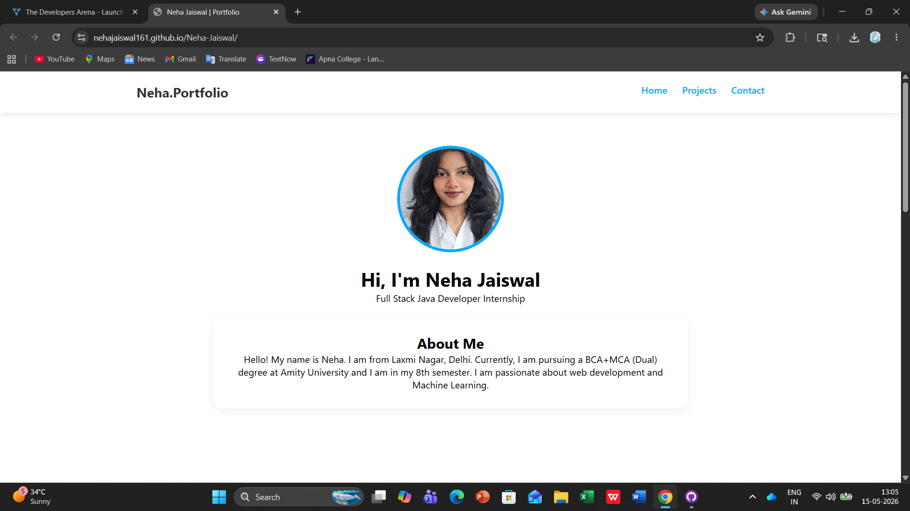
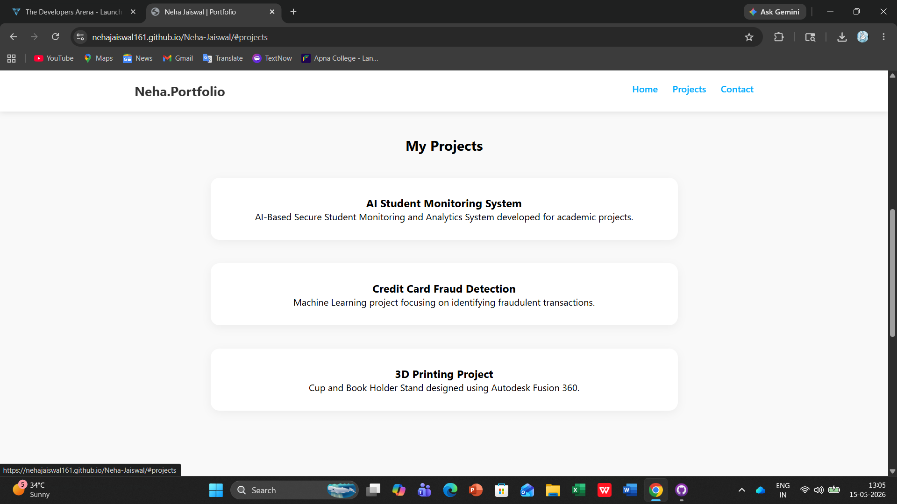
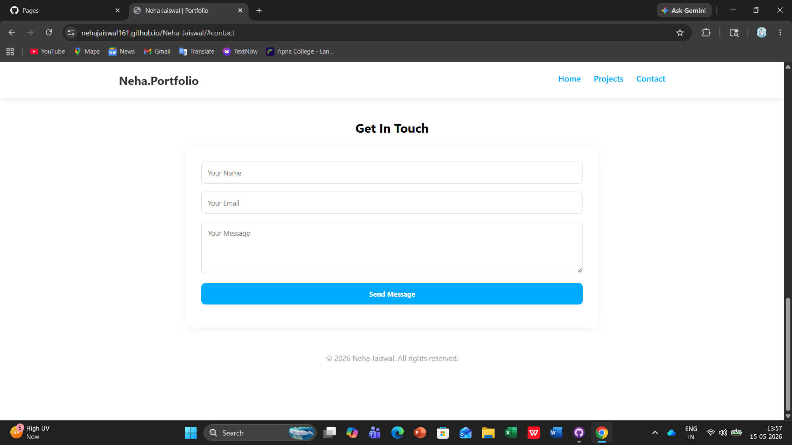
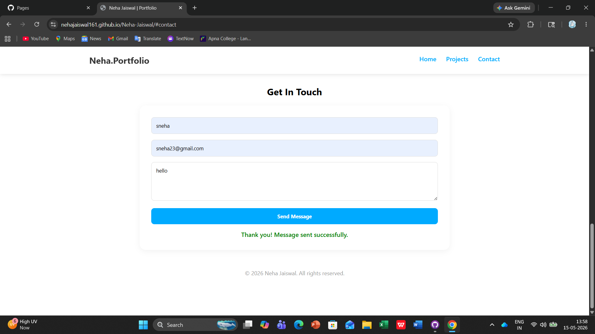

# Week 1 Project: Responsive Personal Portfolio Website

A professional and high-performance portfolio developed as part of my Full-Stack Java Developer Internship. This project serves as a comprehensive digital showcase of my technical projects, skills, and academic achievements.

---

## 1. Project Overview
The objective of this project was to develop a seamless, end-to-end user experience that highlights my expertise in **Machine Learning** and **Web Development**. The site is optimized for performance and accessibility, ensuring a consistent look and feel across all device architectures.

## 2. Setup Instructions
To run this project locally:
1. **Clone/Download**: Download the repository as a ZIP file and extract it.
2. **Directory Structure**: Ensure your folder hierarchy matches: `index.html` at the root, with `/css`, `/js`, and `/images` subfolders.
3. **Execution**: Open `index.html` in any modern browser or use VS Code "Live Server".

## 3. Code Structure & Architecture
The project follows a modular hierarchy to ensure scalability:
- **`index.html`**: Core structure using semantic HTML5 for SEO.
- **`css/style.css`**: Primary stylesheet for layout and theme.
- **`js/navigation.js`**: Managed DOM manipulation, including mobile menu behavior and **Client-side Form Validation**.
- **`images/`**: Centralized directory for optimized visual assets.

## 4. Visual Documentation
The website features a Dynamic Grid Layout for the projects section. Interactive hover effects and a professional color palette enhance user engagement.

#### Home Page

#### Projects Section

#### Contact & Validation

## 5. Technical Details
- **Responsive Architecture**: Developed using a "Mobile-First" approach with **CSS Flexbox** and **Media Queries**.
- **Form Validation**: Implemented custom JavaScript logic to validate user input (Name length, Email format) before submission.
- **Project Integration**: Showcase of projects like **Credit Card Fraud Detection** and **AI-Based Student Monitoring**.

## 6. Testing & Validation Evidence
| Feature | Test Performed | Expected Result | Status |
| :--- | :--- | :--- | :--- |
| **Form Validation** | Submitting empty or invalid email | Show custom red error messages via JS. | **Passed** |
| **Submission Logic** | Submitting valid data | Clear form and show green success message. | **Passed** |
| **Responsive Layout** | Resizing browser (1920px to 375px) | Layout adjusts fluidly; Grid items stack. | **Passed** |
| **Smooth Scrolling** | Clicking Navbar links | Page scrolls smoothly to the target section. | **Passed** |

### **Validation Screenshots:**
Below is the evidence of the working JavaScript validation:

**1. Validation Error (Invalid Input):**

**2. Success Message (Final Result):**

---
**Developer:** Neha Jaiswal  
**Education:** BCA+MCA Dual Degree, Amity University (2027)  
**Focus:** Full-Stack Java Development
